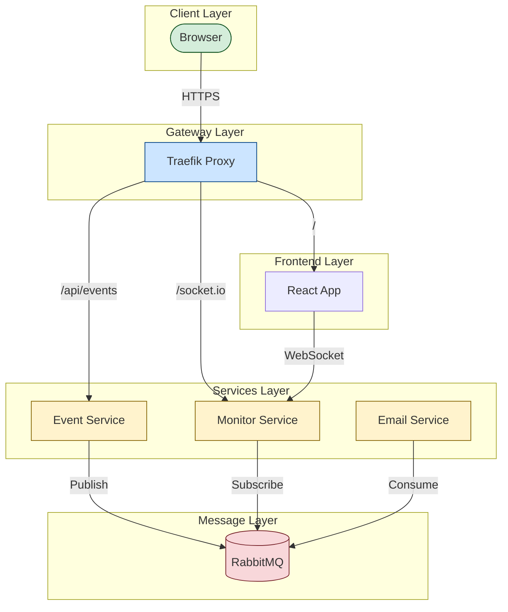

# 🚀 Arquitetura Orientada a Eventos

### Monitor Frontend


### 📊 Diagrama da Arquitetura


## 📋 Stack Tecnológica

- **Message Broker:** RabbitMQ
- **Reverse Proxy:** Traefik (com HTTPS)
- **Microsserviços:**
  - **Event Service:** Node.js com Fastify
  - **Email Service:** Node.js (Consumer RabbitMQ)
  - **Monitor Service:** Node.js com Socket.IO 
- **Frontend:** React.js com Socket.IO 
- **Containers:** Docker & Docker Compose

## 🔧 Pré-requisitos

- Docker 
- Docker Compose 
- Navegador moderno com suporte a HTTPS
- Portas disponíveis:
  - 80: HTTP
  - 443: HTTPS
  - 8080: Traefik Dashboard
  - 5672: RabbitMQ AMQP
  - 15672: RabbitMQ Management
  - 3000: Event Service
  - 3001: Email Service
  - 3002: Monitor Service
  - 5173: Monitor Frontend (React)

## ⚙️ Instalação e Configuração

1. **Clone o repositório:**
   ```bash
   git clone https://github.com/h0rck/event-driven.git
   cd event-driven
   ```

2. **Configure o ambiente:**
   ```bash
   chmod +x setup-traefik.sh
   ./setup-traefik.sh
   ```

3. **Inicie os serviços:**
   ```bash
   docker-compose up -d
   ```

## 🌐 Acessando os Serviços

- **Monitor Frontend:** https://monitor.dev.localhost
- **RabbitMQ Dashboard:** https://rabbitmq.dev.localhost
  - Usuario: guest
  - Senha: guest
- **Traefik Dashboard:** traefik.dev.localhost
- **APIs:**
  - Event Service: https://event-service.dev.localhost
  - Email Service: https://email-service.dev.localhost
  - Monitor Service: https://monitor-service.dev.localhost


